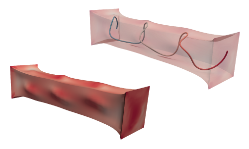

# Abaqus UEL for Spatial Embedded Fibers

Matlab-Abaqus pipeline to model embedded fibers in to hyperelastic solid base material (large deformations). Based on the work by Steinbrecher et al., _A mortar-type finite element approach for embedding 1D beams into 3D solid volumes_, 2020.



## Requirements

Commercial software
* Abaqus, Standard 
* Matlab

For post-processing and visualization
* Paraview

## Intro

We implement and make publicly available a mortar-type FE method for embedding beams in to 3D solid volumes, originally developed by Steinbrecher et al., 2020. 

The pipeline receives as **input**:
* Fiber structure (segment endpoints)
* Fiber geometry (straight, helix, sinusoidal undulations)
* Solid geometry (rectangular dimensions W,D,H in x,y,z axes, respecctively)
* Material parameters (solid, fiber, penalty parameter)
* Segmentation parameters (number of Gauss points, fiber resolution, plotting arguments)
* Boundary conditions (simple shear, uniaxial extension)
* Abaqus solver parameters (stepping, stabilization, etc.

**Output**:
Results of every converged step in *.vtk file format containing:
* Solid stress
* Fiber strain and cross section forces and moments.
* Interface line load between solid and the fibers
* Constraing violation metric.

Additionally, the pipeline outputs a Matlab structure, containing the components of strain energy, for both solid and fibers.

## Tutorial

Everything runs through the main script "Main.m". First section

Fir

```matlab
%UEL Directory and local Paths
WorkDir = './AbaqusWorkDir/'; % Abaqus working directory
MatrixPaths = '/home/datastore/Sotiris/'; % Store directory to save matrices (up to 120 characters)
JobNum = 1; % Abaqus Job number [0-9999]
JobDescription = 'UniaxHelix';

```
